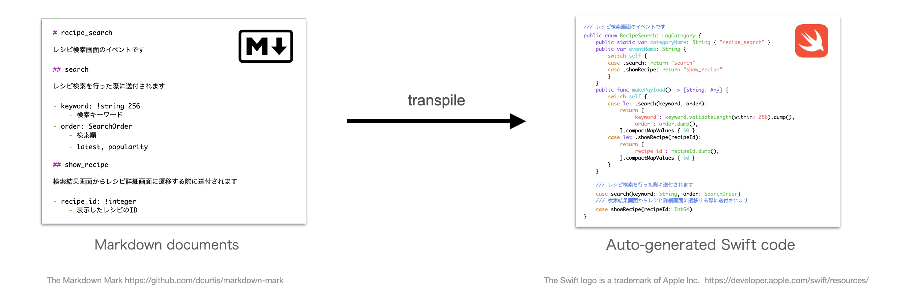
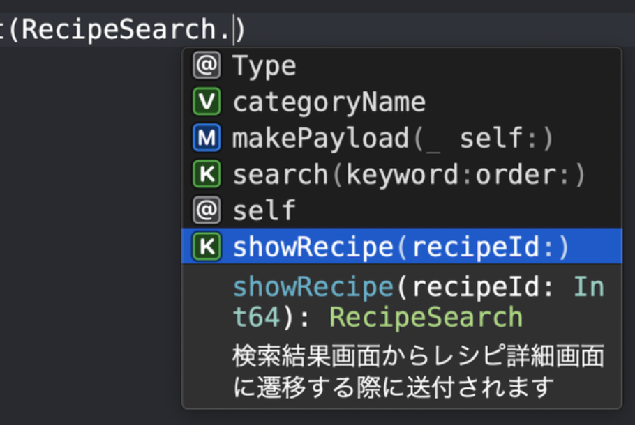

# daifuku
A markdown parser and compiler for log definitions in mobile applications

## Usage 
Automatic generation of document-based type-safe log implementation code



### Step 1
Consider log specifications and write documentation. 

- Syntax: [docs/syntax.ja.md](docs/syntax.ja.md)
- Example: [example/LogDefinitions/recipe_search.md](./example/LogDefinitions/recipe_search.md)

#### Log definition documents (Markdown)

```md
# recipe_search

An category of events related to recipe search.

## search

An event sent when users perform a recipe search.

- keyword: !string 256
    - Search keyword
- order: SearchOrder
   - latest, popularity

## show_recipe

An event sent when users move from the search results screen to the recipe details screen.

- recipe_id: !integer
    - ID of the selected recipe

```

### Step 2

Run the script. 

- Example: [example/iOS/generate-log-classes.rb](./example/iOS/generate-log-classes.rb)

```sh
bundle install
ruby example/iOS/generate-log-classes.rb
```

After that, the following `.swift` files will be automatically generated.

```sh
ls example/AutoGenerated 
# CommonPayload.swift  LogCategories.swift
```

#### Log definition code (Swift)

```swift
/// Events on the recipe search screen
public enum RecipeSearch: LogCategory {
    /// An event sent when users perform a recipe search.
    case search(keyword: String, order: SearchOrder)
    ///  An event sent when users move from the search results screen to the recipe details screen.
    case showRecipe(recipeId: Int64)
}
```

### Step 3

Send logs with the enums of the log definition.

#### Log implementation code (Swift)

```swift
// After the search request 
logger.post(
    RecipeSearch.search(
        keyword: keyword, // “egg" 
        order: order // .latest
    )
)
```

## What makes you happy?

### Fully documented at all times
Because of the way it works, you cannot implement logging without writing documentation. This means that there will always be documentation. 

Happy implementers and happy analysts 😊

### Type safety
#### No unintended values are introduced

Because the possible values, such as character limits, patterns, and numeric ranges, are guaranteed at the type level, it prevents unintended values from entering the log database.

#### Comfortable to be complemented by IDE

Completion during implementation also improves the development experience and reduces mistakes.



### Easy to read for both humans and machines

Markdown is excellent as a format for log definition documents that anyone could easily read and write.

In addition, it was useful to be able to statically analyze both the definition document and the implementation.

For example, mistakes such as "I defined it in the document but forgot to implement it" could be detected automatically.

This mechanism has actually been useful several times in regular CI runs.
(It was also useful to be able to notice when a log was accidentally deleted during refactoring, etc.).

## Case Study

### Git version control in the same repository as the app
In Cookpad (Japan), log definitions and mobile application source code are managed in the same git repository.

#### Everything in one place (easy to find)
It is all in one place, so there is no need to wander around looking for information in logs.

#### Background of log definitions can also be checked by following pull requests

It is also possible to run `git blame` on log markdown definitions and follow pull requests to find out which version of the log was added, who implemented the log, and with what intention.


## Articles (Japanese)
- ドキュメントベースの型安全なモバイルアプリ行動ログ基盤の構築 - クックパッド開発者ブログ https://techlife.cookpad.com/entry/2020/11/05/110000
- モバイルアプリの行動ログの「仕込み」を快適にする https://speakerdeck.com/yujif/iosdc-japan-2022-mobile-app-logging

## Original Author
[@giginet](https://github.com/giginet)

## Contributors
[@hiragram](https://github.com/hiragram)
[@litmon](https://github.com/litmon)
[@ksfee684](https://github.com/ksfee684)
[@aamine](https://github.com/aamine)
[@vincentisambart](https://github.com/vincentisambart)
[@kalupas226](https://github.com/kalupas226)
[@yujif](https://github.com/yujif)

## Contributing
This repo is basically *read-only*. We publish this code for knowledge sharing purposes.
Please note that we cannot guarantee continuous maintenance or responses to Issues or Pull Requests.

## License
MIT License
